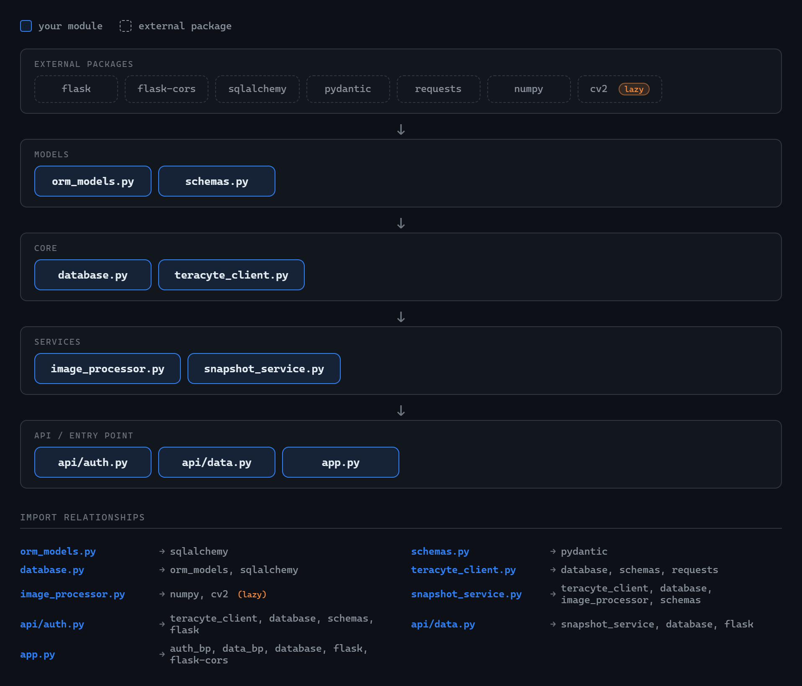

# TeraCyte Dashboard
Live microscope image dashboard — Vue 3 frontend + Python/Flask proxy backend.

Polls a hosted TeraCyte API every 5 seconds, applies Canny edge detection to each new image, stores snapshots in SQLite, and displays live metrics with history browsing.

---
## Architecture
```
Browser (Vue 3, port 80)
│ polls /api/poll every 5 s
▼
Flask Backend (port 5000)
├── api/auth.py 					| login / refresh / me / logout
├── api/data.py 					| poll / history / snapshot / stats
├── services/
│ ├── snapshot_service.py 			| fetch → validate → process → persist
│ └── image_processor.py 			| Canny edge detection (OpenCV)
├── core/
│ ├── teracyte_client.py 			| upstream HTTP client + auto token refresh
│ └── database.py 					| SQLite via SQLAlchemy (tokens + snapshots)
└── models/
├── schemas.py 						| Pydantic v2 request/response models
└── orm_models.py 					| SQLAlchemy ORM table definitions
│
▼
TeraCyte Hosted API
https://assignment-server-rv-866595813231.us-central1.run.app
```



---
## Running with Docker (recommended)

### Prerequisites
- [Docker Desktop](https://www.docker.com/products/docker-desktop/)

### Steps
```bash
git clone https://github.com/ItsEyt/TeraCyte.git
cd TeraCyte
# Create backend environment file
cp backend/.env.example  backend/.env
# Edit backend/.env and set SECRET_KEY to any random string
docker compose up --build
```
Open **http://localhost** in your browser.

To stop:
```bash
docker compose down
```
The SQLite database is stored in a Docker volume (`db-data`) so it persists between restarts. To wipe it:
```bash
docker compose down -v
```
---

## Running Locally (without Docker)

### Backend
Requires Python 3.12+.
```bash
cd backend
python -m venv venv

# Windows
venv\Scripts\activate

# macOS / Linux
source venv/bin/activate

pip install -r requirements.txt
cp .env.example .env
# Edit .env — set SECRET_KEY to any random string
python app.py
# → http://localhost:5000

```
### Frontend
Requires Node 18+.
```bash
cd frontend
npm install
npm run dev
# → http://localhost:5173
```
The Vite dev server proxies `/api/*` to `http://localhost:5000` automatically, so no CORS config is needed during development.

---

## Environment Variables

| Variable | Description | Default |
|---|---|---|
| `TERACYTE_BASE_URL` | URL of the upstream TeraCyte API | (set in `.env`) |
| `SECRET_KEY` | Flask secret key (used by session/extension signing) | `dev-secret` |
| `DB_PATH` | Path to the SQLite database file | `./teracyte.db` |
---
## API Endpoints

| Method | Path | Description |
|---|---|---|
| `POST` | `/api/auth/login` | Login and store tokens |
| `POST` | `/api/auth/refresh` | Renew access token |
| `GET` | `/api/auth/me` | Current user info |
| `POST` | `/api/auth/logout` | Clear stored tokens |
| `GET` | `/api/poll` | Latest image + results (204 if unchanged) |
| `GET` | `/api/history?limit=N` | Stored snapshot history (max 200) |
| `GET` | `/api/snapshot/<image_id>` | Single snapshot by ID |
| `GET` | `/api/stats` | Aggregate metrics across all snapshots |
| `GET` | `/health` | Health check |
---

## Image Processing — Canny Edge Detection

Every new `image_id` is automatically processed before being stored:

**Pipeline:** grayscale → Gaussian blur (5×5) → Canny (low=30, high=100) → 3-channel PNG

The frontend receives both `image_data_base64` (original) and `processed_data_base64` (edge-detected) and provides a toggle button to switch between them.

---
## Database Schema
> built using SQLAlchemy ORM models
```sql
-- Single-row JWT store (only one user session at a time)
CREATE TABLE tokens (
id INTEGER PRIMARY KEY CHECK (id = 1),
access TEXT,
refresh TEXT,
updated_at TEXT
);

-- One row per unique image capture
CREATE  TABLE  snapshots (
id INTEGER PRIMARY KEY AUTOINCREMENT,
image_id TEXT UNIQUE NOT NULL,
timestamp TEXT NOT NULL,
intensity_average REAL,
focus_score REAL,
classification_label TEXT,
histogram_json TEXT, -- JSON-encoded int[256]
image_data_base64 TEXT, -- original PNG
processed_data_base64 TEXT, -- Canny edge PNG
created_at TEXT
);
```
---

## Key Design Decisions

| Decision | Rationale |
|---|---|
| Tokens stored server-side in SQLite | Frontend never touches raw JWTs |
| Single `/api/poll` endpoint | Halves round-trips vs separate image + results calls |
| Dedup on `image_id` before persisting | Avoids redundant processing and DB writes |
| Canny edge detection | Reveals cell boundaries; fast, deterministic, no trainable params |
| Pydantic v2 models | Catches upstream schema drift before it reaches the DB |
| `opencv-python-headless` | No GUI dependencies — safe for server/Docker environments |

---

## Project Structure

```
TeraCyte/
├── backend/
│ ├── api/
│ │ ├── auth.py					| auth endpoints
│ │ └── data.py 				| data endpoints
│ ├── core/
│ │ ├── database.py 			| SQLite persistence layer
│ │ ├── orm_models.py 			| SQLAlchemy table definitions
│ │ └── teracyte_client.py 		| upstream API client
│ ├── models/
│ │ └── schemas.py 				| Pydantic request/response schemas
│ ├── services/
│ │ ├── image_processor.py 		| OpenCV image processing
│ │ └── snapshot_service.py 	| fetch-process-store orchestration
│ ├── app.py 					| Flask app factory + entry point
│ ├── requirements.txt
│ ├── Dockerfile
│ └── .env.example
├── frontend/
│ ├── src/
│ │ ├── api/client.ts 			| axios instance
│ │ ├── components/ 			| Vue components (Dashboard, Login, History, Histogram)
│ │ └── composables/ 			| useDashboard.ts, useAuth.ts
│ ├── Dockerfile
│ ├── nginx.conf
│ └── package.json
└── docker-compose.yml
```

## AI use

Claude was used primarily for:
- General questions and workflow design
- Understanding forgotten concepts
- Learning Vue.js more in-depth
- Canny image processing
- Trivial text generation (such as the basic README.md file / docstrings / types)
- Logging
- Styling & HTML structure
- Generated dependency graph at the top
- Used to create Dockerfiles and debug problems with configuration
